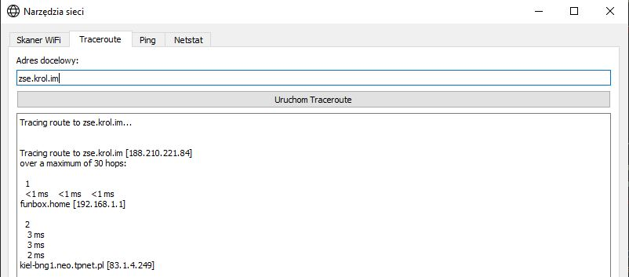
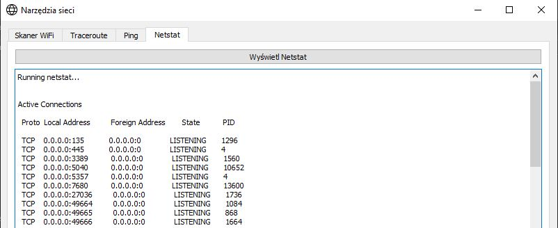
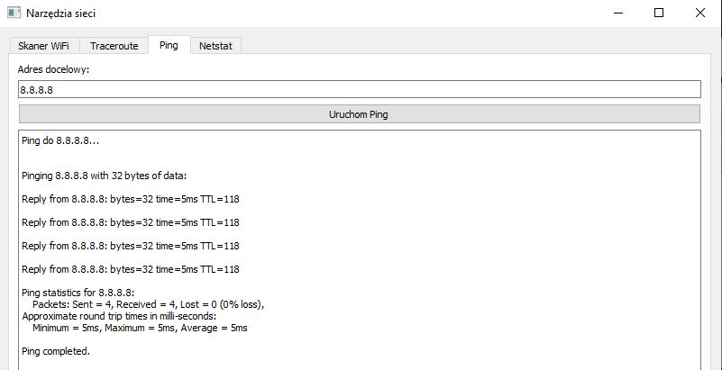

# 🧰 Narzędzia Sieci (Network Tools GUI)

Aplikacja graficzna do diagnostyki i analizy sieci lokalnej, napisana w Pythonie z wykorzystaniem PyQt5. Umożliwia:
- skanowanie sieci WiFi,
- wykonywanie polecenia traceroute,
- wykonywanie poleceń ping,
- przeglądanie aktywnych połączeń przez `netstat`.

## 🖼️ Zrzuty ekranu






## 🛠️ Funkcje

### 🔍 Skaner WiFi
- Wykrywa dostępne sieci bezprzewodowe.
- Wyświetla SSID, kanał, częstotliwość oraz siłę sygnału (w dBm).
- Automatyczne odświeżanie co 10 sekund.

### 🌐 Traceroute
- Umożliwia śledzenie trasy pakietów do wybranego hosta.
- Wspiera `tracert` (Windows) oraz `traceroute` (Linux/macOS).

### 🔄 Ping
- Umożliwia sprawdzenie dostępności i opóźnienia połączenia do hosta.
- Łatwe testowanie responsywności serwerów i urządzeń sieciowych.
- Wspiera standardowe polecenie `ping` dostępne na wszystkich platformach.

### 📡 Netstat
- Pokazuje aktywne połączenia sieciowe.
- Dostosowane polecenia w zależności od systemu operacyjnego (`netstat`, `ss`).

### 🧰 Wymagania

- Python 3.6+
- PyQt5

### Instalacja zależności:
```bash
pip install PyQt5
